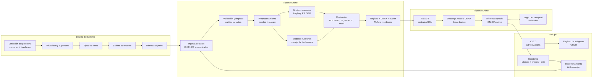

# Pipeline MLOps — Detección de Enfermedades (Comunes y Huérfanas)  
**Versión reestructurada Semanas 5–6 — Proyecto MLOps**

> **Objetivo:** describir un pipeline **end-to-end** completamente implementable que permita desarrollar, entrenar, versionar, desplegar y monitorear un modelo para la detección de enfermedades comunes y huérfanas, utilizando buenas prácticas de MLOps y alineado con el proyecto final (despliegue ONNX, CI/CD dev/prod).

---

# 1. Diseño y supuestos del sistema

## 1.1 Objetivo clínico

El sistema se concibe como una **herramienta de triage y priorización**, no como un sistema de diagnóstico definitivo.

- Determina el estado probable del paciente:
  - **NO ENFERMO**
  - **ENFERMEDAD LEVE**
  - **ENFERMEDAD AGUDA**
  - **ENFERMEDAD CRÓNICA**
- Para enfermedades **huérfanas** la prioridad es **no dejar pasar casos de riesgo**, privilegiando alta **sensibilidad/recall**, incluso a costa de más falsos positivos.
- El resultado debe usarse como apoyo a la decisión clínica, nunca de forma aislada.

---

## 1.2 Tipos de datos utilizados

El sistema trabaja principalmente con datos **tabulares clínicos**:

- **Variables numéricas / ordinales**:
  - Intensidad de fiebre, dolor, número de días con síntomas, frecuencia cardiaca, saturación, edad, etc.
- **Variables categóricas**:
  - Sexo, presencia de comorbilidades, tipo de consulta (urgencias / ambulatoria), centro médico, región.
- **Texto corto (opcional)**:
  - Descripciones libres de síntomas (ej. “dolor torácico punzante”).

Para el pipeline se asume que todos los datos han sido **anonimizados o pseudonimizados** antes de ser usados.

---

## 1.3 Suposiciones fundamentales

1. Existe una **Historia Clínica Electrónica (HCE/EHR)** que concentra los registros clínicos.  
2. Se puede configurar un proceso de **ingesta batch** (no en tiempo real) para extraer datos anonimizados hacia el entorno de analítica/ML.  
3. El proceso de entrenamiento del modelo ocurre en un entorno **offline** (data science / ML).  
4. El modelo de producción se expone a través de un **servicio HTTP (FastAPI)** empaquetado en un **contenedor Docker**.  
5. Los modelos entrenados se almacenan en un **bucket externo** (p.ej. S3, GCS, Azure Blob) y **no** se versionan directamente en el repositorio.  
6. El médico puede:
   - Ejecutar el contenedor en su **computador local**, si los recursos lo permiten.
   - O hacer llamadas al modelo expuesto en un servidor/nube.

---

## 1.4 Restricciones del sistema

- Se deben respetar normas de **privacidad y ética médica**:
  - Datos anonimizados/pseudonimizados.
  - Trazabilidad de accesos.
- El dominio de enfermedades huérfanas introduce **desbalance extremo de clases**.
- El sistema debe permitir **ejecución local** (latencia baja) y despliegue en **infraestructura en la nube**.
- El modelo final debe estar en formato **ONNX** para facilitar despliegue, portabilidad y compatibilidad con múltiples runtimes.

---

## 1.5 Métricas de evaluación

### Enfermedades comunes (muchos datos)

- Accuracy
- F1-score (macro y por clase)
- ROC-AUC
- Sensibilidad / Especificidad

### Enfermedades huérfanas (pocos datos)

- **Recall / Sensibilidad** (minimizar falsos negativos)
- Valor predictivo negativo (NPV)
- PR-AUC (curva precisión–recall)
- Error de calibración (Brier score, curvas de calibración)

### Evaluaciones adicionales

- Análisis de desempeño por **subgrupos** (edad, sexo, centro).
- Monitorización de **calibración** del modelo a lo largo del tiempo.

---

# 2. Pipeline Offline (Entrenamiento → ONNX)

Esta sección describe cómo se entrena y versiona un modelo de ML que, posteriormente, se exporta a ONNX y se usa en producción.  
El repositorio actual **no contiene este código**, pero el pipeline se define para que pueda implementarse de forma directa.

---

## 2.1 Ingesta y gobierno de datos

### Flujo

1. **Extracción de datos** desde la HCE/EHR:
   - Jobs batch (ej. nocturnos o semanales).
   - Acceso exclusivamente a datos anonimizados.
2. **Anonimización / pseudonimización**:
   - Eliminación de identificadores directos (nombre, documento, teléfono, etc.).
   - Reemplazo por IDs internos.
3. **Validación de esquema**:
   - Verificación de columnas esperadas, tipos de datos, rangos básicos.
4. **Carga en repositorios analíticos**:
   - **Data Lake** en formato Parquet para ML.
   - **Data Warehouse** (ej. PostgreSQL, BigQuery) para consultas analíticas.

### Tecnologías recomendadas

- **Python + pandas** para la transformación inicial.  
- **Airflow** para orquestar flujos de ingesta (DAGs).  
- **Almacenamiento**: S3 / GCS / Azure Blob.  
- **DW**: PostgreSQL / BigQuery / Redshift.  
- Opcional: **Great Expectations** para tests de calidad de datos.

---

## 2.2 Preprocesamiento y feature engineering

### Objetivos

- Asegurar que los datos de entrada del modelo sean consistentes y clínicamente interpretables.
- Construir un pipeline reproducible y versionable.

### Pasos principales

- Validación de rangos:  
  - Fiebre: escala 0–10.  
  - Dolor: escala 0–10.  
  - Edad: 0–120.  
  - Días de síntomas: ≥ 0.
- Manejo de **valores faltantes**:
  - Imputación basada en reglas clínicas o estadísticas (media, mediana, imputación por grupo).
- Transformaciones:
  - Escalado de variables numéricas: `StandardScaler` o `RobustScaler`.
  - Codificación de variables categóricas: `OneHotEncoder` u otros codificadores adecuados.
- Features derivadas:
  - Score de comorbilidad.
  - Duración normalizada de síntomas.
  - Combinaciones relevantes (ej. fiebre × días).

### Tecnologías

- `scikit-learn`:
  - `Pipeline`
  - `ColumnTransformer`
- `numpy`, `pandas`.

El preprocesamiento se define dentro del pipeline del modelo para que pueda exportarse a ONNX junto con el clasificador.

---

## 2.3 Manejo de desbalance y modelado

Debido a la naturaleza del problema, se distinguen dos bloques de modelos:

### A) Enfermedades comunes (muchos datos)

#### Modelos candidatos

- **Logistic Regression** (base-line explicable).
- **Random Forest**.
- **Gradient Boosting** (ej. `GradientBoostingClassifier`).
- **XGBoost / LightGBM** (si se requieren modelos más complejos).

Se prioriza:

- Explicabilidad.
- Estabilidad.
- Facilidad de calibración.

### B) Enfermedades huérfanas (pocos datos)

#### Técnicas y enfoques

- **Manejo de desbalance**:
  - `class_weight="balanced"` en modelos lineales y de árboles.
  - Oversampling (RandomOverSampler / SMOTE), con cuidado de no distorsionar la señal clínica.
- **Transfer Learning**:
  - Reutilizar modelos entrenados en dominios clínicos similares.
- **Few-Shot / Meta-Learning**:
  - Métodos como Prototypical Networks, Matching Networks o MAML (si se dispone de infraestructura avanzada).
- **Ensembles calibrados**:
  - Combinación de varios modelos + calibración posterior (Platt Scaling / Isotonic Regression).

### Ajuste de umbrales

- Uso de curvas ROC y PR para determinar umbrales específicos:
  - Umbral conservador para enfermedades huérfanas (se prioriza recall).
- Inclusión de una categoría “**no seguro**” para casos ambiguos, que requieran revisión especializada.

---

## 2.4 Entrenamiento y validación

### Esquemas de validación

- **StratifiedKFold**:
  - Mantiene la proporción de clases en train/validation.
- **Split temporal** (si aplica):
  - Entrenar con datos más antiguos, validar/testear con datos recientes.
- **Evaluación por subgrupos**:
  - Edad, sexo, centro médico, región.

### Métricas clave

- ROC-AUC global.
- F1-score macro.
- PR-AUC, especialmente para clases raras.
- Recall en enfermedades huérfanas.
- Métricas por subgrupo para detectar posibles sesgos.

### Tecnologías

- `scikit-learn` para modelos clásicos y validación.
- **MLflow Tracking** para registrar:
  - Parámetros.
  - Métricas.
  - Artefactos (gráficos, matrices de confusión).
  - Versión de datos y commit de código.

---

## 2.5 Registro, versionado y exportación a ONNX

### Registro en MLflow Model Registry

- Modelo registrado con nombre, por ejemplo: `rare-disease-triage`.
- Versiones múltiples:
  - `v1`, `v2`, ...
- Estados:
  - `None` → `Staging` → `Production`.
- Cada versión incluye:
  - Métricas.
  - Parámetros.
  - Dataset de entrenamiento (hash o localización).
  - Identificador de código (commit git).

### Exportación a ONNX

- Conversión del pipeline `sklearn` a ONNX usando `skl2onnx`.
- Generación de artefactos:
  - `models/rare-disease/dev/model.onnx`
  - `models/rare-disease/prod/model.onnx`
- Subida al bucket externo (no al repositorio).

Ejemplo conceptual de conversión:

```python
from skl2onnx import convert_sklearn
from skl2onnx.common.data_types import FloatTensorType

initial_type = [('input', FloatTensorType([None, n_features]))]
onnx_model = convert_sklearn(sklearn_pipeline, initial_types=initial_type)
with open("model.onnx", "wb") as f:
    f.write(onnx_model.SerializeToString())
```
---
# 3. Pipeline Online (Servicio de Inferencia)

Esta parte conecta el modelo con los médicos u otros sistemas clínicos, utilizando un servicio web desplegado en un contenedor Docker.

---

## 3.1 Estado actual del repositorio

El repositorio implementa actualmente:

- **API FastAPI** (`app/app.py`):
  - `GET /`:
    - Devuelve un formulario HTML sencillo para ingresar síntomas.
  - `POST /predict`:
    - Recibe un JSON con:
      - `fever`, `pain`, `days`, `comorbidity`, `age`.
    - Llama a la función `predict_status` en `model/rules.py`.
  - `GET /health`:
    - Respuesta simple con `status: "ok"` y metadatos del servicio.
- **Modelo placeholder**:
  - `model/rules.py`:
    - Implementa una lógica determinística basada en reglas y puntuaciones.
    - Devuelve uno de los cuatro estados clínicos.
- **Contenerización**:
  - `Dockerfile`:
    - Instala dependencias.
    - Expone el servicio FastAPI con Uvicorn en el puerto 8000.
- **Pruebas unitarias**:
  - `tests/test_rules.py`:
    - Valida que `predict_status` cubre los cuatro posibles estados.
- **CI/CD (GitHub Actions)**:
  - `.github/workflows/pr-ci.yml`:
    - Corre `pytest` en cada PR.
  - `.github/workflows/develop-cicd.yml`:
    - Corre `pytest`, construye la imagen Docker y la publica en GHCR.

Este diseño funciona como plantilla para sustituir `rules.py` por un modelo ONNX en una versión futura.

---

## 3.2 Diseño objetivo con modelo ONNX

En la versión completa del sistema, el servicio de inferencia seguirá estos pasos:

1. **Lectura de configuración**:
   - Variables de entorno como:
     - `MODEL_ENV` (dev/prod).
     - `MODEL_URI` (ruta en bucket).
2. **Descarga del modelo ONNX**:
   - El contenedor descarga `model.onnx` desde el bucket según el entorno.
3. **Carga del modelo en memoria**:
   - Uso de `onnxruntime.InferenceSession` para instanciar el modelo.
4. **Inferencia en `/predict`**:
   - Validación de entrada con Pydantic.
   - Construcción del vector de entrada de acuerdo al pipeline ONNX.
   - Ejecución del modelo y obtención de logits/probabilidades.
   - Decodificación de la clase (NO ENFERMO / LEVE / AGUDA / CRÓNICA).
5. **Respuesta estructurada**:
   - Devuelve estado, probabilidad y metadatos (timestamp, modelo, versión).

### Escenarios de ejecución

- **Local (PC del médico)**:
  - `docker pull ghcr.io/usuario/mlops-rare-disease:latest`
  - `docker run -p 8000:8000 ghcr.io/usuario/mlops-rare-disease:latest`
  - El médico accede a `http://localhost:8000`.
- **Servidor o nube**:
  - Despliegue en una instancia EC2/VM/ECS/Kubernetes.
  - Integración con otros sistemas mediante API.


# 4. Pipeline Offline (Entrenamiento y Preparación del Modelo)

El pipeline offline transforma datos clínicos anonimizados en un modelo entrenado, validado, versionado y exportado a ONNX. Esta etapa ocurre **fuera del despliegue** y es responsabilidad del equipo de ciencia de datos.

---

## 4.1 Ingesta y Gobierno de Datos

### Objetivo
Construir un flujo confiable para obtener datos limpios, anonimizados y listos para ML.

### Procesos
- Extracción desde EHR/HCE, CSV o APIs internas.
- Anonimización/pseudonimización:
  - Eliminación de nombre, identificación, contacto.
  - Asignación de identificadores internos.
- Validación de calidad:
  - Tipos de datos, rangos, outliers, valores faltantes.
  - Reglas clínicas (ej.: edad > 120 → inválido).
- Carga en:
  - **Data Lake** (Parquet).
  - **Data Warehouse** (PostgreSQL / BigQuery).

### Tecnologías
- Python + pandas  
- Airflow (DAGs de ingesta)  
- Almacenamiento: S3 / GCS / Azure Blob  

---

## 4.2 Preprocesamiento y Feature Engineering

### Objetivo
Estandarizar la preparación de datos mediante pipelines reproducibles.

### Componentes
- Validación de esquema.  
- Escalado de variables numéricas (`StandardScaler` / `RobustScaler`).  
- Codificación de categóricas (`OneHotEncoder`, `OrdinalEncoder`).  
- Transformadores clínicos personalizados (ej.: escalas de dolor, tiempo de evolución).  
- Pipeline reproducible con `sklearn.Pipeline` y `ColumnTransformer`.

### Tecnologías
- scikit-learn  
- numpy / pandas  

---

## 4.3 Manejo de Desbalance y Modelado

### Problema
Las enfermedades huérfanas tienen **muy pocos datos**.

### Soluciones propuestas
- **Oversampling** (SMOTE, RandomOverSampler).  
- **Class weights** en modelos lineales/árboles.  
- **Ajuste de umbrales** según costo clínico (falsos negativos muy costosos).  
- **Modelos supervisados candidatos**:
  - Logistic Regression  
  - Random Forest  
  - Gradient Boosting  
  - XGBoost o LightGBM  
- Enfoque opcional de dos etapas:
  - (1) sano vs enfermo  
  - (2) tipo de enfermedad  

### Métricas de evaluación
- ROC-AUC y F1 Macro  
- PR-AUC para clases raras  
- Sensibilidad/Recall priorizado  

---

## 4.4 Entrenamiento y Validación

### Validación
- **StratifiedKFold** (mantener prevalencias).
- **Split temporal** si hay evolución en el tiempo.
- Validación por subgrupos (sexo, edad, centro médico).

### Evaluación
- Curvas ROC, PR y calibración.  
- Brier Score.  
- Matriz de confusión.  

---

## 4.5 Registro del Modelo y Exportación a ONNX

### MLflow Model Registry
- Se registran:
  - Parámetros.
  - Métricas.
  - Artefactos asociados.
  - Fuente del dataset.
  - Commit del código que generó la versión.

### Exportación a ONNX
- Conversión con `skl2onnx` para empaquetar:
  - Preprocesamiento.
  - Modelo final.
- Artefactos:
  - `models/rare-disease/dev/model.onnx`
  - `models/rare-disease/prod/model.onnx`
- Se guardan en un **bucket externo**, nunca en el repositorio.

---

## 4.6 Preparación del Modelo para Servir (Serving-Ready)

### Objetivo
Dejar un artefacto listo para ser descargado por el servicio de inferencia.

### Incluye
- Validación final del modelo convertido.  
- Pruebas unitarias sobre el archivo ONNX.  
- Firma del contrato I/O:
  - Entradas: síntomas y datos clínicos.
  - Salida: clase + probabilidades.  

### Checklist final
- Pipeline sklearn → ONNX.
- Validación de inferencia en ONNXRuntime.
- Subida del artefacto al bucket (dev/prod).
- Registro de versión en MLflow.

---
# 5. Diagrama del Pipeline (Versión Semanas 5–6)


# 6. Notas de implementación mínima (estado actual del repositorio)

El repositorio implementa una **API de ejemplo** con una función determinística (`model/rules.py`) que devuelve uno de los 4 estados clínicos.

Este “modelo” funciona como un **placeholder** y permite:

- Validar el diseño del servicio (FastAPI, endpoints, formulario HTML).  
- Verificar la contenerización mediante **Docker**.  
- Probar el flujo de **CI/CD** con GitHub Actions y publicación de imágenes en GHCR.  

En una versión futura, `model/rules.py` podrá ser sustituido por un **modelo ONNX** entrenado siguiendo el pipeline offline descrito anteriormente, manteniendo el **mismo contrato** de entrada/salida y conservando las **pruebas automatizadas** del sistema.

